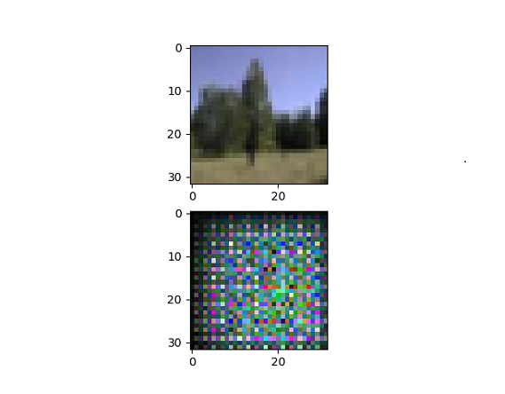

# Autoencoder
A simple image autoencoder for the CIFAR 10 dataset. Compresses images by over 80% then learns to reconstruct them. CIFAR images are 32x32 pixels, which is why the original images are such low quality. This is just a proof of concept until I can obtain more computing power.

## Outputs
### Initial output

### Trained output

